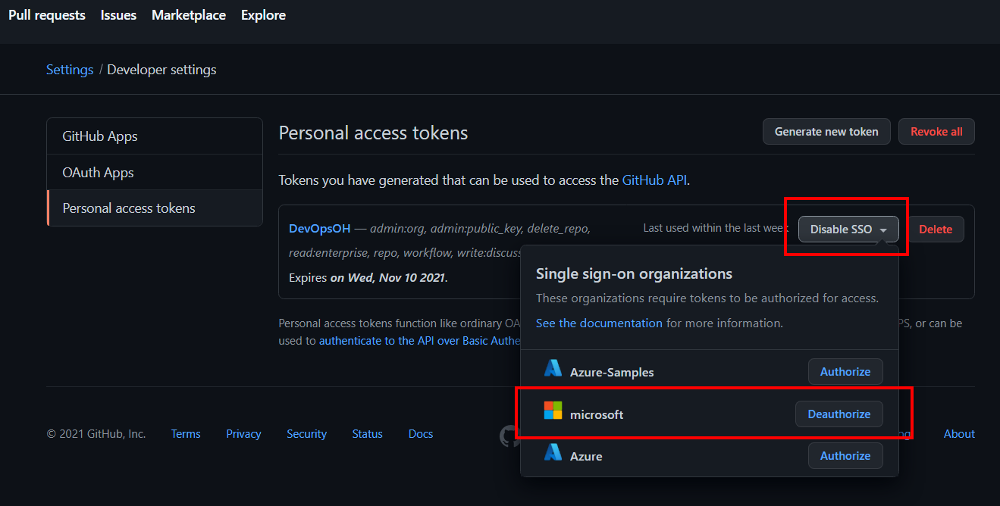

# DevOps OpenHack Deployment for GitHub

## Setting up permissions

Before continuing, ensure you understand the permissions needed to run the OpenHack on your Azure subscription and your GitHub organization.

This lab deploys to a single resource group within an Azure subscription. To deploy this lab environment, ensure the account you use to execute the script got the Azure Owner Role.

## Prerequisites

- [Azure Subscription](https://azure.microsoft.com/) with [Owner](https://docs.microsoft.com/en-us/azure/role-based-access-control/built-in-roles) role
- [GitHub Organization](https://docs.github.com/en/organizations/collaborating-with-groups-in-organizations/about-organizations) within [GitHub Enterprise Cloud](https://docs.github.com/en/get-started/learning-about-github/githubs-products#github-enterprise) with [GitHub Advanced Security](https://docs.github.com/en/get-started/learning-about-github/about-github-advanced-security)
- Linux Bash ([Windows Subsystem for Linux (WSL)](https://docs.microsoft.com/en-us/windows/wsl/) works too)
- [Azure CLI 2.28.0](https://docs.microsoft.com/en-us/cli/azure/install-azure-cli-linux) or higher
- [GitHub CLI 2.0.0](https://cli.github.com/) or higher
- [jq 1.5](https://stedolan.github.io/jq/download/) or higher

> **Note** [Azure Cloud Shell](https://docs.microsoft.com/en-us/azure/cloud-shell/overview) is **not supported** for GitHub deployment scenario.

## Expected resources

### azuresp.json

The `deploy-gh.sh` script creates `azuresp.json` file with Service Principal credentials. Service Principal has **Owner** role, and it's dedicated for the OpenHack only.

> **NOTE** Please keep this file for future use by your team members.

### Azure

| Azure resource        | Pricing tier/SKU | Purpose                            | Resource Providers |
| --------------------- | ---------------- | ---------------------------------- | ------------------ |
| Azure Resource Group  | N/A              | Resource Group for Terraform state | N/A                |
| Azure Storage Account | Standard_LRS     | Storage for Terraform state        | Microsoft.Storage  |

### GitHub

| GitHub resource    | Name                           | Purpose                                             |
| ------------------ | ------------------------------ | --------------------------------------------------- |
| Team               | N/A                            | Team for team members                               |
| Repository         | N/A                            | Git repository with OpenHack files                  |
| Repository Project | N/A                            | Project for work organization                       |
| Actions Secret     | LOCATION                       | Variable with Azure location for resources          |
| Actions Secret     | TFSTATE_RESOURCES_GROUP_NAME   | Variable with Resource Group for Terraform state    |
| Actions Secret     | TFSTATE_STORAGE_ACCOUNT_NAME   | Variable with Storage Account for Terraform state   |
| Actions Secret     | TFSTATE_STORAGE_CONTAINER_NAME | Variable with Storage Container for Terraform state |
| Actions Secret     | TFSTATE_KEY                    | Variable with State Key for Terraform state         |
| Actions Secret     | AZURE_CREDENTIALS              | Variable with Azure Service Principal               |

## Deployments Steps

### Azure pre-deployment steps

Login to your Azure Subscription.

```bash
az login
```

Make sure your login context uses the correct Azure Subscription.

```bash
az account show
```

If not, then change to your Azure Subscription dedicated for the OpenHack.

```bash
az account set --subscription <subscriptionId>
```

Verify your account permissions for the subscription. Expected value: `Owner`.

```bash
az role assignment list --assignee $(az account show --output tsv --query user.name) --output tsv --query [].roleDefinitionName --include-inherited
```

### GitHub pre-deployment steps

Login to your [GitHub](https://github.com) account and [Create a Personal Access Token](https://docs.github.com/en/authentication/keeping-your-account-and-data-secure/creating-a-personal-access-token) with scope: `repo, workflow, admin:org, admin:public_key, delete_repo, write:discussion, read:enterprise`.

> **GitHub Personal Access Token authorization for use with SAML single sign-on**
>
> In some cases, if your GitHub account is associated with an organization that uses SAML single sign-on (SSO), you must first authorize the token. Follow this guide on how to do it: [Authorizing a personal access token for use with SAML single sign-on](https://docs.github.com/en/authentication/authenticating-with-saml-single-sign-on/authorizing-a-personal-access-token-for-use-with-saml-single-sign-on)
> 
> Authorization of the PAT for single sign on for the Azure Samples repository
> 
>

Then set environment variable `GITHUB_TOKEN` with generated token.

```bash
export GITHUB_TOKEN="<GitHubPAT>"
```

### Deployment

Run `deploy-gh.sh` bash script to start Azure & GitHub configuration.

> **NOTE**
>
> For Azure Location, `koreasouth`, `westindia`, `australiacentral` are not supported!

```bash
./deploy-gh.sh -l <AzureLocation> [-o <GitHubOrgName> -t <TeamName> -a <AzureDeployment>]
```

> **Defaults for optional parameters**
>
> -o GitHubOrgName = CSE-OpenHackContent
>
> -t TeamName = randomly generated number with 5 digits
>
> -a AzureDeployment = true (deploy Azure resources, if false, then just configure GitHub)

### Azure post-deployment steps

Add OpenHack team members to Azure Subscription with **Contributor** role, follow guide: [Assign Azure roles using the Azure portal
](https://docs.microsoft.com/en-us/azure/role-based-access-control/role-assignments-portal)

### GitHub post-deployment steps

Add OpenHack team members to GitHub Team, follow guide: [Adding organization members to a team
](https://docs.github.com/en/organizations/organizing-members-into-teams/adding-organization-members-to-a-team)
